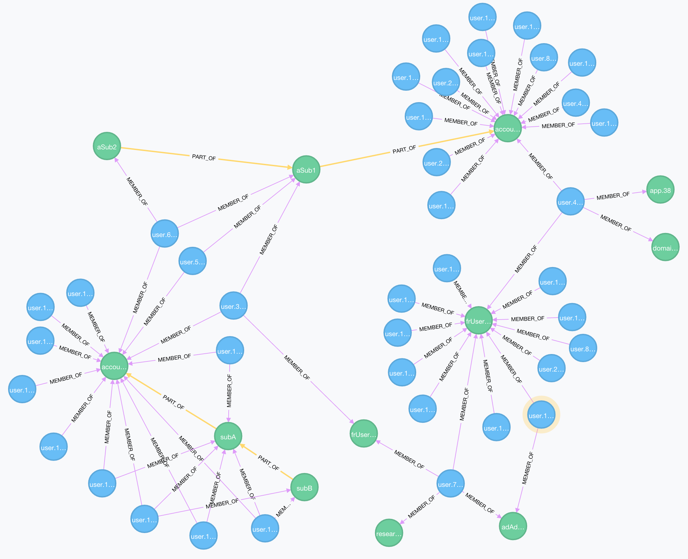

# LDAP to graph Loader #

Graph Loader, v 1.0

### Summary
The Graph Loader tool creates a Neo4J Graph database from data read from LDAP (v 1.0). In the graph, Users and Groups are related using 2 types of relationships:

* `MEMBER_OF` : user group membership
* `PART_OF` : Group hierarchy, relates a child to its parent Group

Sample resulting Graph:

The idea is to then :

1. use the graph to optimize and simplify the LDAP Directory, through the use of relevant CYPHER queries (V 2.0). The optimizations could then be reported and acted upon.
2. use the graph directly in Access Policy decisions

Finally (v 3.0), the Analyzer could apply the suggested optimizations directly to the LDAP directory.

Note that the Loader can also be just used as such: an LDAP to Graph loader tool.

### Features
Currently at *version 1* (December 2015), the Graph Analyzer has the following features:

* Uses the [UnboundID SDK](https://www.ldap.com/unboundid-ldap-sdk-for-java) to perform _paginated_ LDAP Searches on any LDAP Directory source.
* Uses the UnboundID LDAP connection pool.
* Uses a custom lightweight extendable Connector framework, to accommodate more diverse data sources in the future.
* Uses LDAP attribute to Neo4J Property mappings to filter and transform LDAP Attributes.
* Uses the Neo4J REST APIs for all Graph I/O operations. The assumption is that the Neo4J server could be anywhere (including the cloud), and thus not embedded.
* All Processing is done in memory with I/O operations kept to a minimum.
* Supports USERS and GROUP hierarchies.
* Uses Java Logging to log its operation.

A sample LDIF files is provided, with 2000 users and 200 groups (file: `data/NeoLDAPSample.ldif`). The group memberships are random.

### Requirements
The utility is built as a *Gradle* project using the *Groovy* language. It therefore requires:

* The [Groovy](http://www.groovy-lang.org/download.html) language. On Mac: `brew install groovy`.
* [Gradle](http://gradle.org/gradle-download/). On Mac: `brew install gradle`.

### Installation

1. Download the source (use the **`dev`** branch !).
2. Update the configuration files to match your environment (location: the `resources` subdir). See below for configuration details...
3. From the source dir: `gradle build --refresh-dependencies` .
4. To Run: `neoLoader.sh` - Or on Windows boxes: 
`groovy -cp build/libs/LdapGraphLoader-0.0.1-SNAPSHOT.jar:runtime/* -Djava.util.logging.config.file=resources/logging.properties NeoLoader.groovy`

### Configuration

The Graph Loader uses the following config files...

###### ldapServer.properties

Gathers all the connectivity and metadata of the source LDAP Directory. In particular:

* `host` : LDAP Server Host
* `port` : LDAP Server Port
* `binddn` : LDAP Admin User DN
* `password` : LDAP User password
* `userBasedn` : The DN of the container under which the User Accounts are stored. The Loader will _NOT_ create a node for this container (on flat DIT, it may contain millions of user accounts, which would imply too many relationships in the graph for a single node).
* `groupBaseDn` : The DN of the container under which the Groups are stored. The Loader will _NOT_ create a node for this container.
* `userobjclass` : The LDAP Objectclass of the User Accounts. Used for searching.
* `groupobjclass` : The LDAP Objectclass of the Groups. Used for searching.
* `memberattribute` : The name of the Group multi-valued attribute that stores group members. The Member values are expected to be User Account DNs.
* `nbconnections` : The number of connections to use in the LDAP Connections pool.
* `pagesize` : The size of the LDAP search page to use while searching. For best results, this should be set to the LDAP Server search limit.

###### logging.properties

The Java Logging properties file. Used here mainly to set the log level for the utility. Just set the `.level` property. 

###### NeoServer.properties

Gathers all configuration information pertaining to the target Neo4J server. I.e.,

* `host` : The Neo4J Host
* `port` : The Neo4J port
* `authorization`: The Base64-encoded basic HTTP authentication credentials for the Neo4J User, used in REST calls to Neo4J. The encoded string is in the form: `<user>:<password>`

###### propertyMaps.json

A JSON file that provides LDAP Attribute to Neo4J Node Property mappings for each Entity supported by the Loader. The Entities can be either of Group or Person. Mappings are provided for each: LDAP Attributes (left) are mapped to Neo4J property names (right). The Loader will only fetch the LDAP attributes mapped here.

### About Performance

The Graph Loader is designed with performance in mind, at the cost of RAM. It performs the minimal I/O operations on both source and target sides. To achieve this, the Loader buffers *all* read LDAP entries in memory. 

The amount of memory required depends on the number of attributes mapped (the fewer the smaller the amount of required RAM), the size of the mapped attribute values and the number of Entries to load. Several GB of RAm may be required for millions of LDAP entries.

Since the Neo4J server is expected to be remote, the Loader can't use the Neo4J Java SDK, which only supports (as of Dec. 2015) embedded Neo instances. The loader therefore has to issue as many REST create calls as there are nodes and relationships to create (see also section 'Next Steps' below). The Neo4J I/Os are the bottleneck here.

Benchmarking baseline, using the provided LDIF sample:

_2002_ Users, _205_ Groups and _2774_ Relationships created in about **35s** on a Mac powerbook with 16GB RAM...

### Next Steps

Possible future enhancements:

* Support for Organization Entity hierarchies
* Add a _MaxMemory_ config parameter to limit the amount of RAM used by the tool
* Support for LDIF Source files
* Support SSL connections
* Determine if multi-threading can help performance
* Determine better/faster ways to create nodes and relationships in Neo4J. In particular: batch loads.
* REST API server to trigger all actions through REST.
* A Web UI for integration in the Cloud.

For v 2.0:

* Devise and write CYPHER queries to optimize the graph (and hence the source LDAP directory)
* Orchestrate optimization/analysis of the graph and produce reports.

For v 3.0:

* Modify the Source LDAP Directory based on the optimization reports.

### Who do I talk to? ###

* Repo owner or admin
* [alex@3edges.com](mailto:alex@3edges.com)